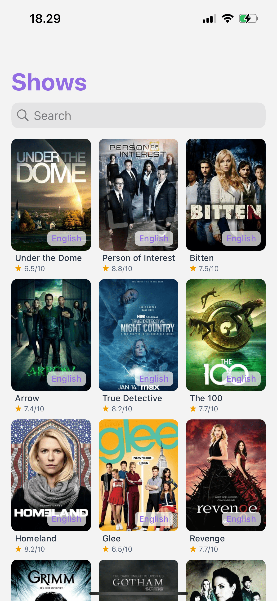
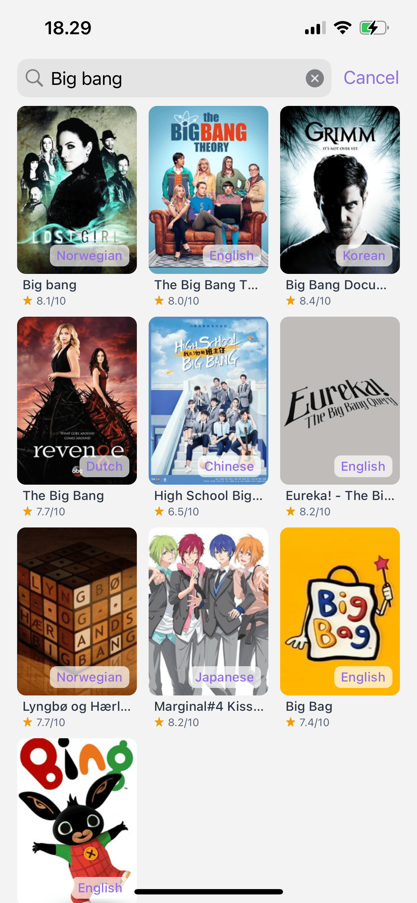
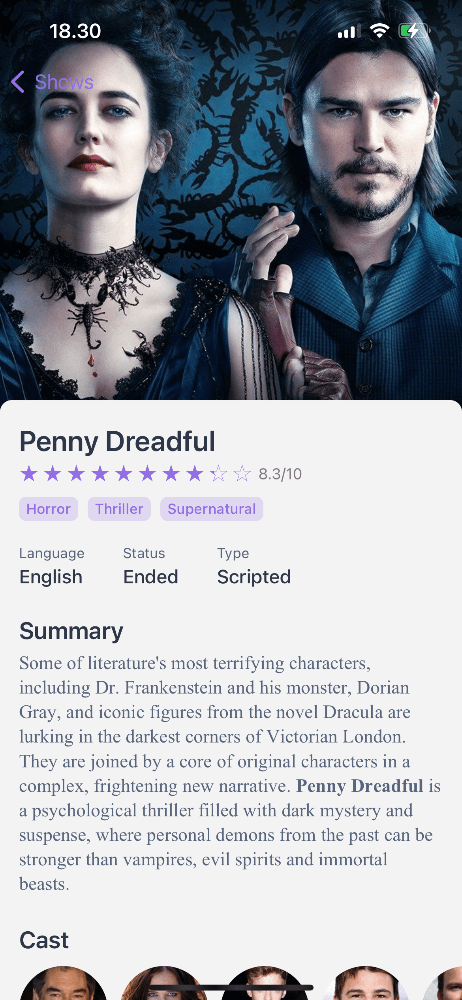
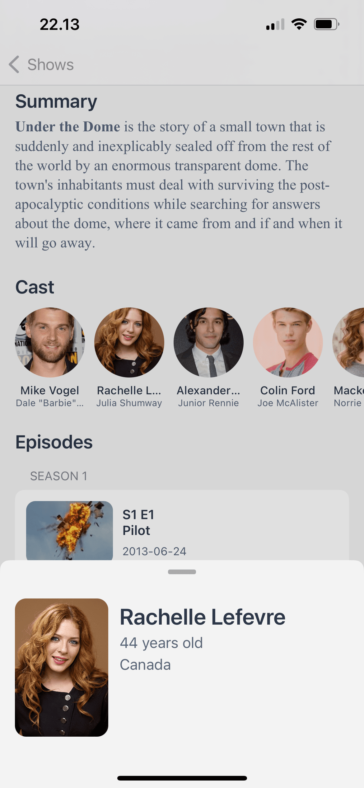

# TVShowsApp
An iOS app that allows users to find information about TV shows, built with TVMaze Api, UIKit programmatic, clean architecture, and Combine Framework.

## Build With
- URL Session
- Clean architecture with MVVM
- UIKit Programmatically
- Combine 
- Diffable Data Sources
- TVMazeAPI (https://www.tvmaze.com/api)
- SDWebImage (https://github.com/SDWebImage/SDWebImage)
- Cosmos star rating control (https://github.com/evgenyneu/Cosmos)

## Features
- Collectionview with pagination and refresh
- TVShow, cast, and episodes list
- Search show

## Demo
| Home | Search |
| :---------: | :---------: |
|  |  |

| Show Detail | Cast Detail |
| :---------: | :---------: |
|  |  |
